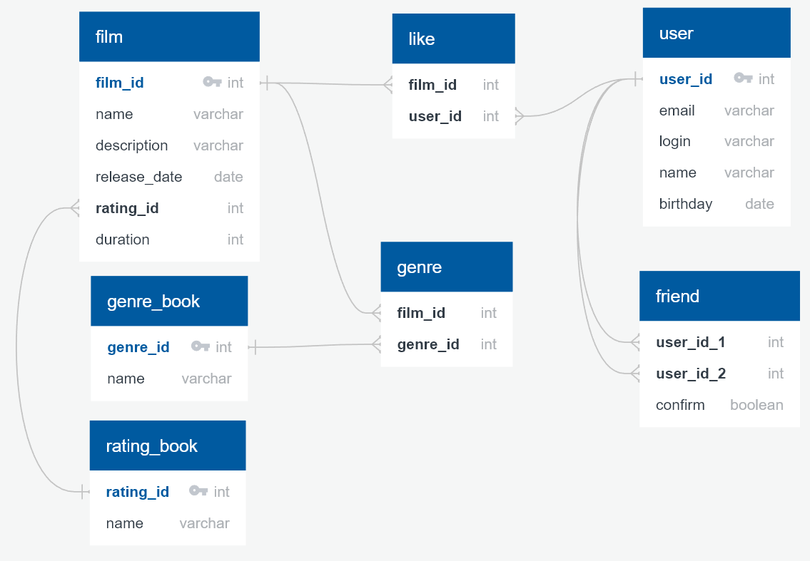

<h2 align="center">
    Схема БД проекта java-filmorate<br><br>
    
</h2>

<h3 align="center">
    Описание таблиц в БД:
</h3>

- **"FILM"** - все фильмы системы
- **"USERS"** - все пользователи системы
- **"GENRE"** - таблица для связей один к многим, так как у фильма может быть много жанров,
  здесь будет список всех жанров для всех фильмов, соответственно, по film_id можно получить
  список всех жанров для этого фильма
- **"GENRE_BOOK"** - справочник жанров
- **"RATING_BOOK"** - справочник рейтингов
- **"LIKES"** - аналогично таблице **"GENRE"** связывает фильмы и пользователей, хранит все лайки.
  По user_id можно получить все лайки (id фильмов), которые поставил этот пользователь.
  По film_id можно получить все лайки (id пользователей), которые пользователи поставили этом фильму.
- **"FRIEND"** - таблица для хранения дружбы между пользователями. Одна строка - одна запись односторонней дружбы.

*Таблицы "LIKES" и "USERS" названы во множественном числе, чтобы не конфликтовать с зарезервированными словами SQL.*

<h3 align="center">
    Примеры основных SQL-запросов к БД
</h3>

Вывод всех фильмов по алфавиту, рейтинг выводится с описанием, а не просто по id:
```sql
SELECT f.name, f.description, rb.name AS RATING_NAME, f.release_date, f.duration FROM film AS f
LEFT JOIN rating_book AS rb ON f.rating_id = rb.rating_id
ORDER BY f.name 
```
Вывод всех названий жанров для фильма по film_id (для примера 4):
```sql
SELECT f.film_id, f.name, gb.name FROM genre AS g 
LEFT JOIN genre_book AS gb ON gb.genre_id = g.genre_id
LEFT JOIN film AS f ON g.film_id = f.film_id
WHERE g.film_id = 4
```
Вывод всех имен пользователей, кто поставил лайк фильму по film_id (для примера 4):
```sql
SELECT u.name FROM likes AS l 
LEFT JOIN users AS u ON l.user_id = u.user_id
WHERE l.film_id = 4
```
